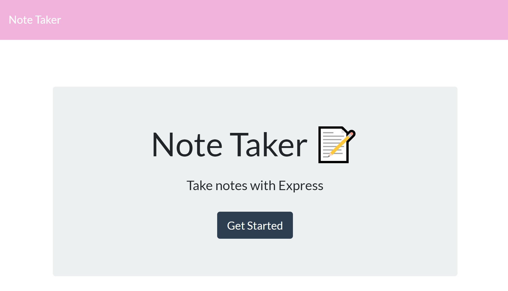

# Note-Taker

## Table of Contents

* [Introduction](#Introduction)
* [Requirements](#Requirements)
* [Installation](#Installation)
* [Links](#Links)
* [Aithors](#Authors)

## Introduction
Use this application to write, save, and delete notes. The application utilizes express on the backend while also saving and retrieving the note data from a JSON file.



## Requirements
* [NPM] (https://nodejs.org/en/)

## Installation
To install the necessary dependencies, run the following command:
```
npm install
```

## Links
[Take Some Notes](https://fast-plateau-31399.herokuapp.com/)

## Authors
Amor Andal: [Email](aandal77@gmail.com)